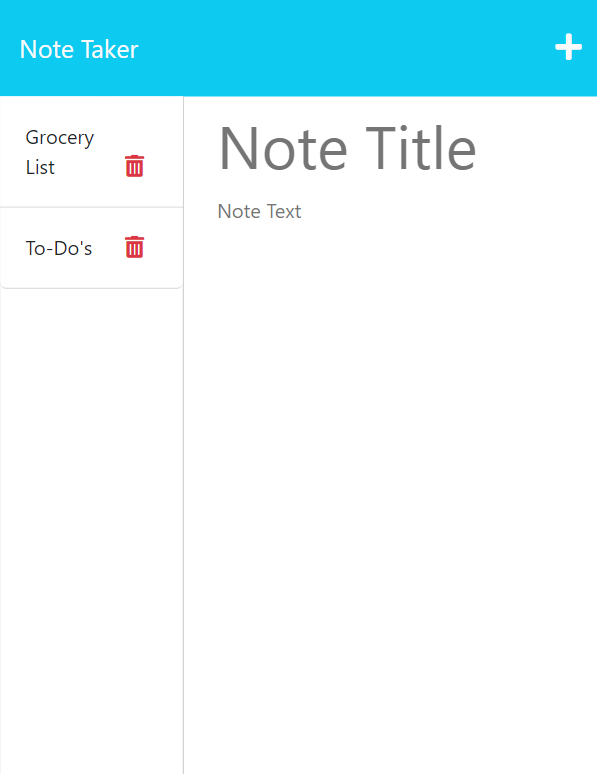

# expressjs-note-taker []
 
  ## Description

  In this project we modified starter code to create an application called Note Taker that can be used to write and save notes. This application uses an Express.js back end and saves and retrieves note data from a JSON file.

  ## Table of Contents

- [Installation](#installation)

- [Usage](#usage)

- [License](#license)

- [Contributing](#contributing)

- [Tests](#tests)

- [Questions](#questions)

  ## Installation

  Install command is "npm i"

  ## Usage

  Click the "Get Started" button to access your personal note pad. Add a Note Title & Text and then click the save icon in the upper right corner to store your note. You can store multiple notes to the left hand column and click on any of them to read the Note Text.

  [Click here for live website](https://note-expressjs-taker.herokuapp.com)

  

  ## License

  This application is covered under the MIT License. 

  Please see link for additional information:
  (https://opensource.org/licenses/MIT)

  ## Credits

  Dane Shrewsbury

  [Myro Lee](https://github.com/myrojoylee)

  ## Tests

  NA

  ## Questions

  ### Please see below for additional information about this project:

  [GitHub](https://github.com/jjsdunc88)

  [Email](mailto:jjsduncan@gmail.com)
